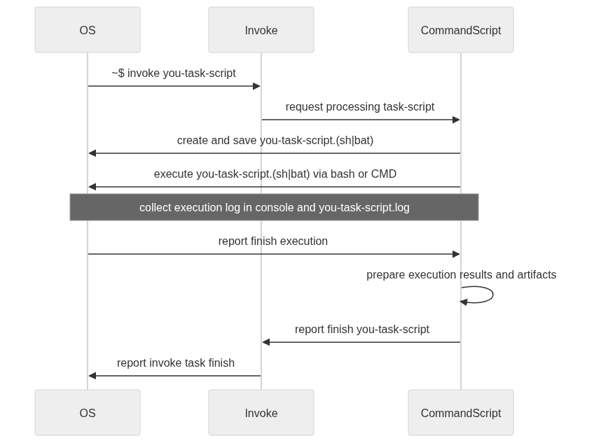

# [CommandScript](https://pypi.org/project/commandscript/)

[](LICENSE)
[](https://www.python.org/downloads/)

CommandScript is a Python library that provides utilities for task management through the creation and execution of OS-specific scripts. It simplifies cross-platform command execution by generating shell scripts (.sh for Unix-like systems, .bat for Windows) and handling logging, timing, and error checking automatically.

Based on the [invoke](https://www.pyinvoke.org/) library, it allows you to create collections of tasks running along the following pipeline:



## Features

- **Cross-platform script execution**: Automatically generates and executes OS-specific scripts (Bash for Linux/macOS, Batch for Windows)
    - ⚠️ MacOS (NOT TESTED)
    - ✅ Linux (POSIX)
        - Generates `.sh` Bash scripts
        - Uses `bash` for execution
        - Measures execution time with nanosecond precision
    - ✅ Windows (NT)
        - Generates `.bat` Batch scripts
        - Uses `cmd.exe` for execution
        - Handles Windows path separators and quoting
        - Supports delayed variable expansion
- **Task management**: Built-in support for Invoke tasks with decorators
    - each task you launch:
        - will collect its log twice: in console and special file (defined for the task unique)
        - if managed via `ScriptExecutor` will has two files for yourself:
            1. script file: `path/to/.generated/your-script-task.(sh|bat)`
            2. script logs: `path/to/.generated/your-script-task.log`
     - when task is finished:
         - its script is saved and could be launch via terminal directly
         - its execution log is saved and could be open in IDE for analytics
- **Environment context**: Global environment variable management for script execution
- **Integrated logging**: Colored console output and file logging with timestamps
- **Error handling**: Automatic return code checking and error logging on failures
- **Timing**: Execution duration measurement for performance monitoring

## Installation

Install CommandScript using pip:

```bash
pip install commandcript
```

### Dependencies

CommandScript requires the following dependencies (automatically installed):

- `invoke>=2.2.0` - Task execution framework
- `colorama>=0.4.6` - Cross-platform colored terminal text

## Quick Start

✅ Good practice example you can see the [tasks.py](https://github.com/AlexeyPerestoronin/CommandScript/blob/master/tasks.py) in this repository.

### Basic Usage

```python
import os
import commandcript

# Set up environment context
commandcript.ENV_CONTEXT \
    .add_env_var('PROJECT_GIT_DIR', '/path/to/project') \
    .add_env_var('COMMANDSCRIPT_SCRIPT_DIR', '${PROJECT_GIT_DIR}/scripts')

# Create and execute a simple command
executor = commandcript.ScriptExecutor(
    log_dir=commandcript.ENV_CONTEXT.COMMANDSCRIPT_SCRIPT_DIR,
    execute_created_script=True
)

executor.add_cwd('/path/to/working/directory') \
        .add_command(['echo', 'Hello, World!']) \
        .execute(log='hello_world')
```

### Using with Invoke Tasks

```python
import invoke
import commandcript

commandcript.ENV_CONTEXT.add_env_var('COMMANDSCRIPT_SCRIPT_DIR', '/path/to/folder/with/generated/scripts/.generated')

# Define a task
@commandcript.script_task()
def build(ctx):
    """Build the project"""
    commandscript.ScriptExecutor.from_ctx(ctx) \
        .add_cwd(commandscript.ENV_CONTEXT.PROJECT_GIT_DIR.hld) \
        .add_command(['python', 'setup.py', 'build']) \
        .execute(log='build')

# Create namespace and run
namespace = invoke.Collection()
namespace.add_task(build)
```

### Environment Setup
`commandcript.ENV_CONTEXT` is a global instance of the `EnvContext` class, which is a specialized dictionary for storing environment variables as `EnvVariable` objects used across `@commandcript.script_task()` instances.

The `EnvContext` class provides additional functionality for managing environment variables, including the `add_env_var` method for retrieving OS environment variables with defaults and automatic variable substitution.

**Variable substitution**: You can use `${VAR}` syntax in default values. The value will be stored in two forms:
- `.hld` — hold value with OS-specific substitution placeholders (e.g., `$VAR` on POSIX, `%VAR%` on Windows)
- `.exp` — fully expanded value with all substitutions resolved

Before using CommandScript, set up the environment context:

```python
from src.commandscript import ENV_CONTEXT

ENV_CONTEXT\
    .add_env_var('PROJECT_GIT_DIR', f'{__file__}/../')\
    .add_env_var('COMMANDSCRIPT_SCRIPT_DIR', '${PROJECT_GIT_DIR}/.generated')\
    .add_env_var('PROJECT_DIST_DIR', '${PROJECT_GIT_DIR}/dist')

# Access values
print(ENV_CONTEXT.PROJECT_DIST_DIR.hld)  # ${PROJECT_GIT_DIR}/dist  (or %PROJECT_GIT_DIR%/dist on Windows)
print(ENV_CONTEXT.PROJECT_DIST_DIR.exp)  # /path/to/project/dist
```

### Multi-command execution

```python
import commandcript

commandcript.ENV_CONTEXT.add_env_var('LOG_DIR', '/path/to/logs')

executor = commandcript.ScriptExecutor(commandcript.ENV_CONTEXT.LOG_DIR, True)

executor.add_cwd('/tmp') \
        .add_env({'MY_VAR': 'value'}) \
        .add_command(['export', 'MY_VAR=override']) \
        .add_command(['echo', '$MY_VAR']) \
        .add_command(['ls', '-la']) \
        .execute(log='multi_command')
```

### Task with Parameters

```python
@commandcript.script_task(
    help={
        'target': 'Build target (default: all)',
        'clean': 'Clean before build'
    }
)
def build(ctx, target='all', clean=False):
    executor = commandscript.ScriptExecutor.from_ctx(ctx)

    if clean:
        executor.add_command(['make', 'clean'])

    executor.add_command(['make', target]) \
            .execute(log=f'build_{target}')
```

## API Reference

### ScriptExecutor

The main class for executing commands via OS-specific scripts.

- **Constructor**:
    ```python
    ScriptExecutor(log_dir: EnvVariable, execute_created_script: bool, task_path: Optional[str] = None)
    ```
    - `log_dir`: `EnvVariable` object pointing to the directory where log files and scripts will be stored (uses `.exp` internally)
    - `execute_created_script`: If True, executes the generated script; if False, only generates it
    - `task_path`: Optional path to the task source file (auto-set when using `@script_task()`)
- **Class Methods**
    - `from_ctx(ctx) -> ScriptExecutor`: Create a `ScriptExecutor` from an invoke context. Automatically extracts `script_dir`, `launch`, and `task_path` from the context.
- **Methods**
    - `add_cwd(cwd: str)`: Set working directory for script execution
    - `add_env(env: dict)`: Add environment variables
    - `add_command(command: list, enter=True, offset=True)`: Add a single command
    - `add_commands(commands: List[list], enter=True, offset=True)`: Add multiple commands
    - `execute(log: str = None) -> Optional[Exception]`: Execute the script and log output. Returns `Exception` on failure, `None` on success.

### EnvVariable

Represents a single environment variable with support for cross-platform substitution syntax.

- **Properties**
    - `name`: The variable name
    - `hld`: Hold value with OS-specific substitution placeholders (`$VAR` on POSIX, `%VAR%` on Windows)
    - `exp`: Fully expanded value with all `${VAR}` substitutions resolved
    - `__str__()`: Returns the hold value (`.hld`)

### EnvContext

Specialized dictionary (`Dict[str, EnvVariable]`) for managing environment variables.

- **Methods**
    - `add_env_var(env_var_name: str, default_value: str = None) -> EnvContext`: Add an environment variable from OS environment with fallback to default value. Supports `${VAR}` substitution in default values.

### @script_task()

Decorator for defining Invoke tasks with CommandScript integration.

```python
@commandcript.script_task(
    help={'param': 'Description'},
    iterable=['param']
)
def my_task(ctx, param=None):
    # Task implementation
    pass
```

### Logging

CommandScript provides colored logging utilities:

- `info`: General information (black)
- `success`: Success messages (green)
- `status`: Status updates (blue)
- `warning`: Warning messages (yellow)
- `error`: Error messages (red)
- `fail`: Failure messages (red) — provides `log_fail(message)` which returns an `Exception`

All loggers' `log_line()` method returns the logger instance for method chaining.

```python
import commandscript

commandscript.info.log_line("This is an info message")
commandscript.success.log_line("Operation completed successfully")
commandscript.error.log_line("An error occurred")
```
